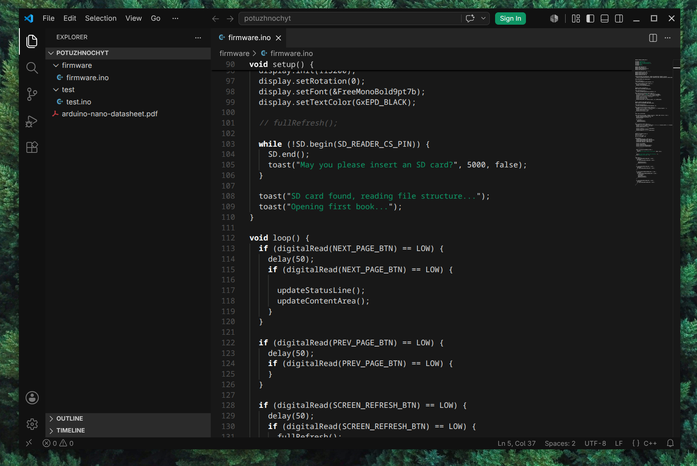
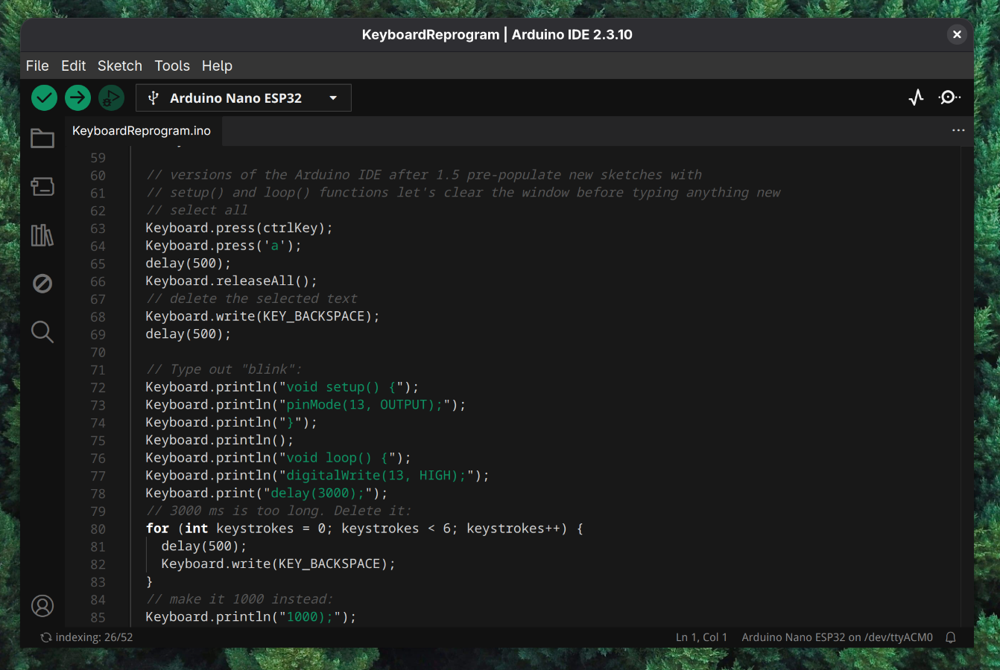

# Monochromatic

## A distraction-free theme for VS code

The code editor color theme that just works. Rid your eyes of strain and focus on what matters.





> [!tip]
> The theme should work with all VS Code compatible editors, only VS Code and Arduino IDE were tested, though.

## Installation

### For VS Code:

1. Go to **Releases** and download the .vsix file.
2. In VS Code go to **Extensions** - click the **...** (Views and More Actions...) button at the top and choose **Install from VSIX...**.
3. The extension should appear in the **Extensions** menu. Click on it and press **Set color theme**.
4. *Enjoy!*

### For Arduino IDE:

1. Check if your Arduino IDE installation folder contains the **plugins** directory. If not - create it.
2. Open the *.arduinoIDE/plugins* directory.
3. Clone the repository to this folder:
```bash
git clone https://github.com/renko-exe/vscode-monochromatic-theme.git
```
4. Restart **Arduino IDE**, press ```Ctrl + ,``` (comma) to open the Preferences menu and choose the newly installed theme here.
5. *Enjoy!*